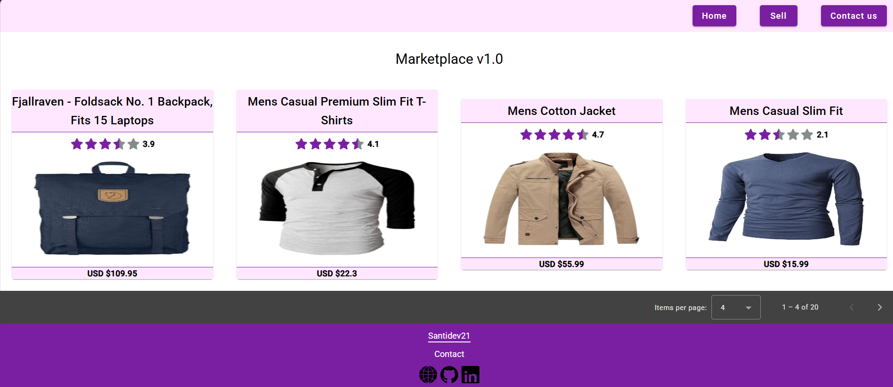

# Marketplace 🛒

A simple **Marketplace project** built with **Angular 16**, using the public API [FakeStoreAPI](https://fakestoreapi.com) to display products.

This project was developed to practice REST API consumption, UI components, and Angular Material.

## 📸 Demo

 <!-- Upload your screenshot and adjust the path -->

## 🚀 Technologies Used

- **Angular 16**
- **Angular Material**
- **TypeScript**
- **RxJS**

## ✨ Features

- Integration with [https://fakestoreapi.com](https://fakestoreapi.com)
- Product listing with:
  - Image
  - Name
  - Price
  - Rating (displayed with stars ⭐)
- Custom star-rating component
- Responsive design using Angular Material
- Basic product detail page

## 📁 Project Structure

```plaintext
/src
 ┣ app
 ┃ ┣ components
 ┃ ┃ ┣ footer → site footer
 ┃ ┃ ┣ header-menu → header / menu
 ┃ ┃ ┗ main-page
 ┃ ┃    ┗ home
 ┃ ┃       ┣ product-card → product card component
 ┃ ┃       ┗ product-detail → product detail component
 ┃ ┣ shared
 ┃ ┃ ┗ star-rating → ⭐ custom star rating component
 ┃ ┣ models → TypeScript models
 ┃ ┣ services → API services
 ┃ ┣ app-routing.module.ts
 ┃ ┗ app.module.ts
